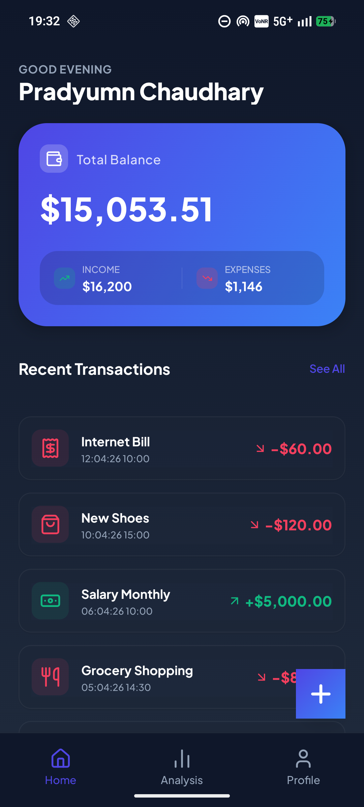
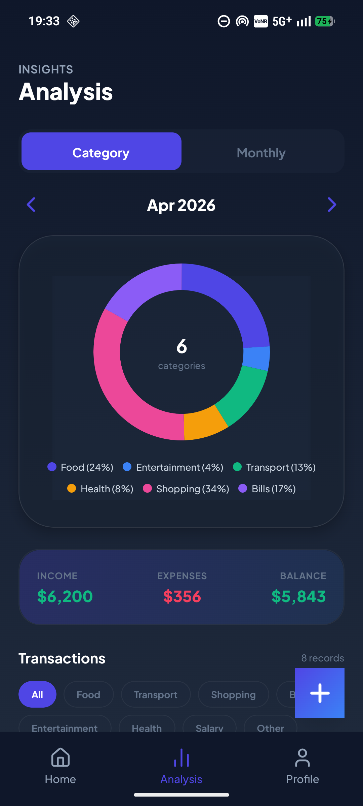
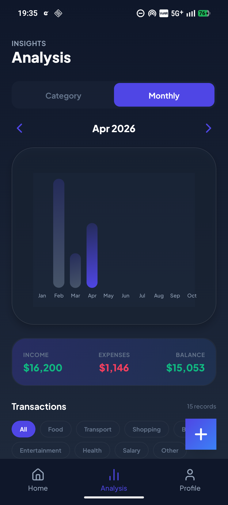
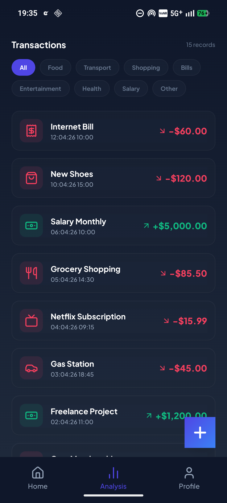
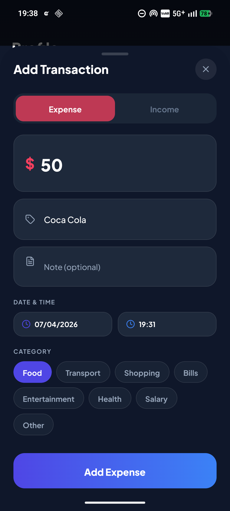
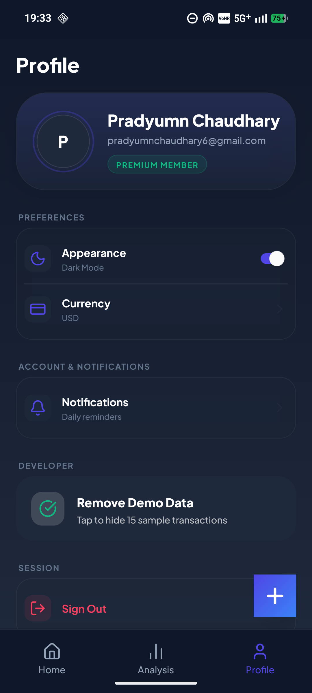

# TrackUrFinance (TUF) 📊

**TUF** is a premium, high-performance personal finance tracker built for the modern user. Combining sleek fintech aesthetics with powerful local-first data management, TUF helps you stay on top of your financial health with ease and style.

[](https://expo.dev/)
[](https://reactnative.dev/)
[](https://www.typescriptlang.org/)
[](https://www.nativewind.dev/)

---

## ✨ Key Features

- **🚀 High-Performance Dashboards**: Real-time balance updates with dynamic gradient cards.
- **📈 Advanced Analytics**: Interactive Pie and Bar charts for deep insights into your spending patterns.
- **🌙 True Dark Mode**: A meticulously crafted dark theme for comfortable night-time tracking.
- **🌍 Multi-Currency Support**: Track your finances in USD, EUR, INR, or GBP.
- **💾 Data Privacy & Security**: A local-first approach to ensure all your financial data remains securely on your device at all times.
- **🌓 Native Gesture Navigation**: A smooth, fluid experience with native transitions and conflict-free edge-swipe tab navigation.
- **📦 Instant Demo Experience**: One-tap demo data generation to explore all features without needing to manually add transactions.

---

## 📱 App Screens

|                Home Screen                 |               Analysis (Category)               |               Analysis (Monthly)                |
| :----------------------------------------: | :---------------------------------------------: | :---------------------------------------------: |
|  |  |  |

|                  Transaction List                  |                   Add Transaction                    |               Profile Settings                |
| :------------------------------------------------: | :--------------------------------------------------: | :-------------------------------------------: |
|  |  |  |

---

## 🛠️ Tech Stack

- **Framework**: [Expo](https://expo.dev/) (SDK 54) / [React Native](https://reactnative.dev/)
- **State Management**: [Zustand](https://github.com/pmndrs/zustand) (Persistence via [AsyncStorage](https://react-native-async-storage.github.io/async-storage/)) + [Context API](https://react.dev/learn/passing-data-deeply-with-context) for Theme management.
- **Styling**: [NativeWind](https://www.nativewind.dev/) (Tailwind CSS for React Native)
- **Navigation**: [React Navigation](https://reactnavigation.org/) (Bottom Tabs)
- **Animations**: [React Native Reanimated](https://docs.swmansion.com/react-native-reanimated/)
- **Charts**: [React Native Gifted Charts](https://github.com/Abhinav-Purwar/react-native-gifted-charts)
- **Icons**: [Lucide React Native](https://lucide.dev/guide/packages/lucide-react-native)

---

## 🚀 Getting Started

### Prerequisites

- [Node.js](https://nodejs.org/) (v18 or higher)
- [npm](https://www.npmjs.com/) or [yarn](https://yarnpkg.com/)
- [Expo Go](https://expo.dev/client) app installed on your physical device (optional for testing)

### Installation

1. **Clone the repository**

   ```bash
   git clone https://github.com/Pradyumn-Chaudhary/trackurfinance-tuf.git
   cd trackurfinance-tuf
   ```

2. **Install dependencies**

   ```bash
   npm install
   ```

3. **Start the development server**

   ```bash
   npm start
   ```

4. **Run on a device/emulator**
   - Press `a` for Android Emulator
   - Press `i` for iOS Simulator
   - Scan the QR code with your camera (iOS) or Expo Go (Android) to run on a physical device.

---

## 📥 Download & Demo

- **Download**: [Download TUF Preview v1.0.0](https://github.com/Pradyumn-Chaudhary/TrackUrFinance-TUF/releases/download/v1.0.0/TrackUrFinance-TUF.apk)
- **Demo Video**: [Watch App Demo](https://youtube.com/shorts/l30l3kqR2h8?si=4_2mBtijm8hwI7tB)

---

## 🗺️ Roadmap

- ☁️ Cloud Sync & Backup (Supabase/Firebase integration)
- 🧠 AI-Powered Smart Categorization
- 📄 Professional PDF/CSV Financial Reports
- 👥 Shared Wallets for Collaborative Tracking
- 🔐 Biometric Authentication (FaceID/Fingerprint)

---

## 📄 License

This project is licensed under the MIT License - see the [LICENSE](LICENSE) file for details.

---

## 🤝 Contributing

Contributions are what make the open-source community such an amazing place to learn, inspire, and create. Any contributions you make are **greatly appreciated**.

1. Fork the Project
2. Create your Feature Branch (`git checkout -b feature/AmazingFeature`)
3. Commit your Changes (`git commit -m 'Add some AmazingFeature'`)
4. Push to the Branch (`git push origin feature/AmazingFeature`)
5. Open a Pull Request
